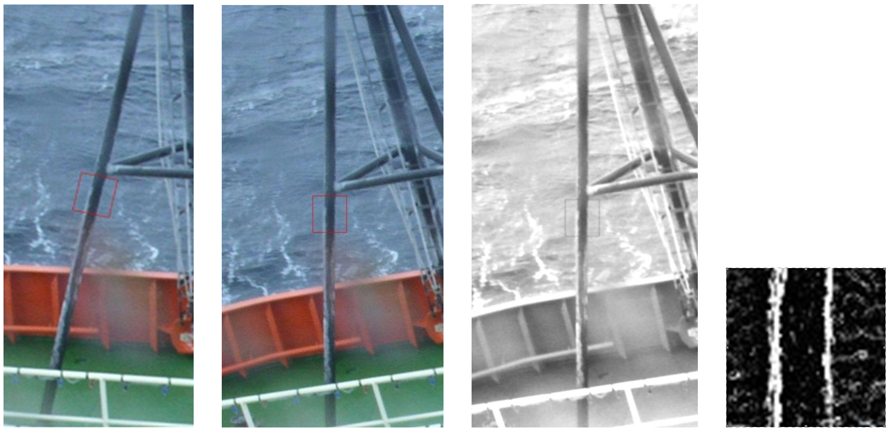
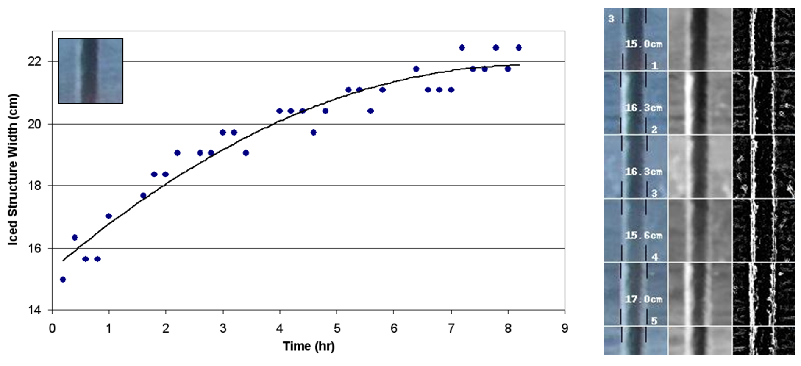
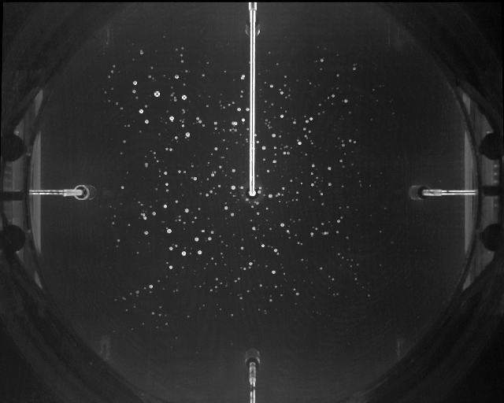
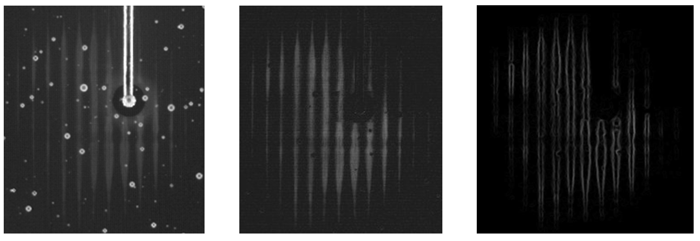
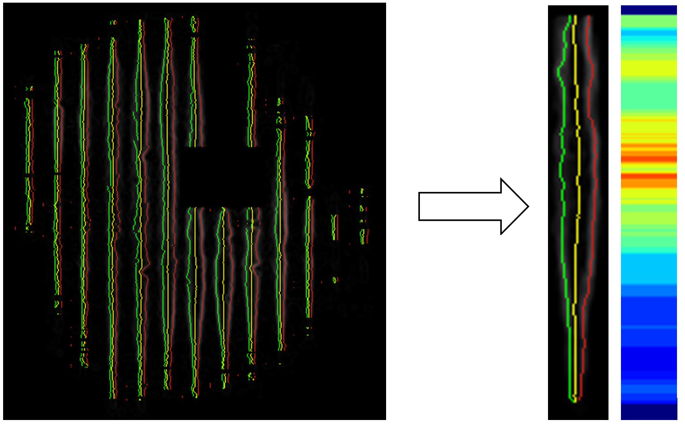
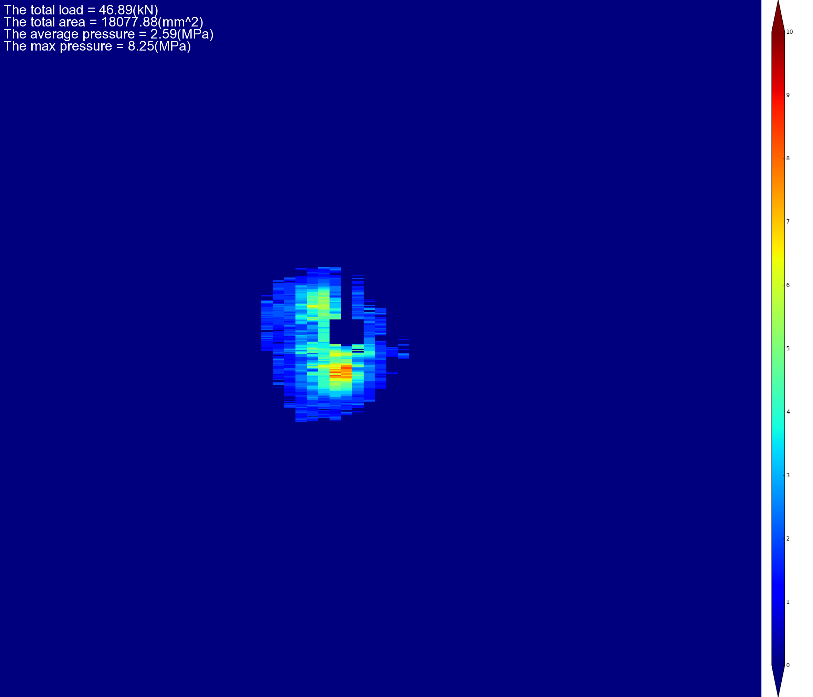

# Analysis Strategies for Marine Icing and Impact Module Images

Image analysis strategy has been developed to analyze Marine Icing images for the purpose of obtaining quantitative time series icing thickness growth. The same technique has been also found to be very effective for acquiring pressure data from images from a novel opto-mechanical pressure sensor technology that is incorporated in a new ice impact panel. The images from the Impact Module provide the test information of dropping an ice block onto the Module, and the analysis technique is able to analyze the images because the test information is recorded on the width of the object and can be calculated from the measurements. 

## Image Analysis for Marine Icing

### Image processing  

### Measurement of a Vertical Structure  

## Image Analysis for Impact Module

### Source Image               

### Image processing 

### Converting Strip Width into Pressure  

### Converting Source Image into Pressure Distribution Map  

